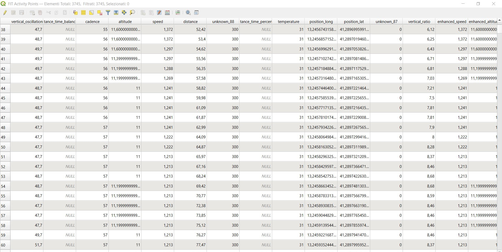

# FitLoader


This simple QGIS plugin imports FIT files into a point vector layer, utilizing the [`python-fitparse`](https://github.com/dtcooper/python-fitparse) module. Only records with geographic coordinates are included, so activities recorded indoors, for instance, will be excluded. All data from the imported records are stored as attributes in the point vector layer.


## Dependencies

* `python-fitparse`


### Installing External Python Modules for QGIS

To extend the functionality of QGIS with additional Python modules, you may need to install them in the environment where QGIS’s Python interpreter can access them. Follow these instructions for each platform:

#### 1. **Windows**
   - **Locate the QGIS Python Directory**: Find the QGIS installation folder, typically located in `C:\Program Files\QGIS <version>`.
   - **Open OSGeo4W Shell**: Launch the "OSGeo4W Shell" from your QGIS installation folder or Start Menu. This shell is configured to use QGIS’s Python environment.
   - **Install the Module**: In the OSGeo4W Shell, use `pip` to install the desired module:
     ```shell
     pip install <module_name>
     ```

#### 2. **macOS**
   - **Locate QGIS Python Path**: By default, QGIS on macOS includes its own Python installation. You’ll need to identify the correct Python path, which is usually in `/Applications/QGIS.app/Contents/MacOS/bin/python3`.
   - **Use Terminal to Install Modules**:
     - Open the Terminal application.
     - Run the following command to install the module within QGIS’s Python environment:
       ```shell
       /Applications/QGIS.app/Contents/MacOS/bin/pip3 install <module_name>
       ```

#### 3. **Linux**
   - **Open Terminal**: Linux installations usually have QGIS set up with the system Python, so you can use your system's default `pip` command.
   - **Install Module**:
     - Use the following command in Terminal:
       ```shell
       sudo pip3 install <module_name>
       ```
     - Alternatively, if you prefer not to use `sudo`, you can use `pip install --user <module_name>` to install it locally for the user.


## Instructions

Here is a step-by-step guide to using the FitLoader plugin in QGIS:

1. **Open the FitLoader Plugin**:
   - Go to the main menu in QGIS.
   - Select `Plugins` > `FitLoader` > `Load Fit Activity`.
   - Alternatively, you can click the **FitLoader** button on the plugins toolbar if it’s visible.

2. **Select the FIT File**:
   - A file selection dialog will appear.
   - Browse your folders and select the `.fit` file you want to import.
   - Confirm the selection to load the FIT activity as a point layer in QGIS.

The next picture shows the attribute table of an imported FIT file, displaying all the data fields associated with each record.

With these steps, your FIT file will be imported into your QGIS project, ready for analysis or display.


